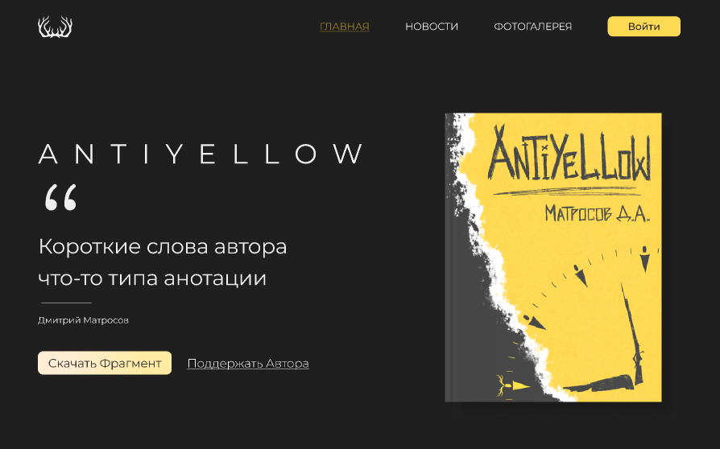

## AntiYellow



``` 
Blog for book "AntiYellow"
``` 

## Настройка
Первоначально устанавливаем в каждой папке зависимости. Меняем конфиг на фронте 
src/configs/global.config.ts
```js
if (import.meta.env.PROD) {
    result = {
        SERVER_HOST: 'https://[server host]:[server port]',
        FRONT_HOST: 'https://[server host]/',
    }
}
```
Билдим фронт ``` npm run build ```, затем запускаем через ``` npm run preview ```(Фронт запускается на 4173 порте)
Переходим на бек ``` /backend ```, тут меняем дб конфиг ``` /configs/db.config.js ```. Меняем только поля USER, PASSWORD и DB.
Далее открываем ``` /common.config.js ``` тут меняем фронтовский url(для корсов).

Далее нужно настроить аватарку пользователя, создаём в корне сервера такую структуру
```
tmp 
| - files
| - - ... 
```

Внутри папки files выполняем команду:
``` wget https://img.freepik.com/free-vector/illustration-businessman_53876-5856.jpg ```
Затем
``` mv illustration-businessman_53876-5856.jpg avatar.jpg ```
Запускаем сервер ``` npm start ``` 

Заходим в index.js и комментируем следущие строки
```js 
db.sequelize.sync({
  force: true
}).then(() => {
  console.log('Drop and Resync Database with { force: true }');
  initial();
});
```


Поздравляю всё работает =) 